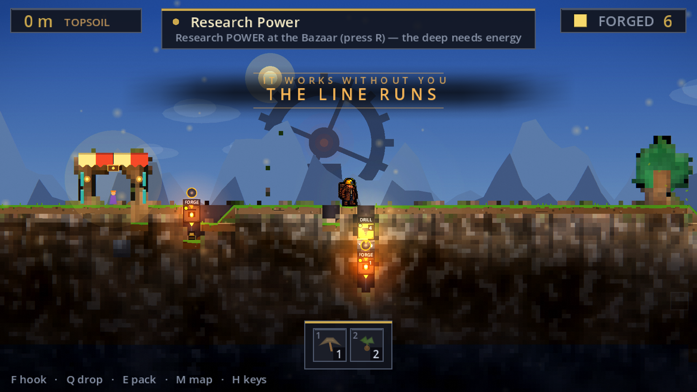
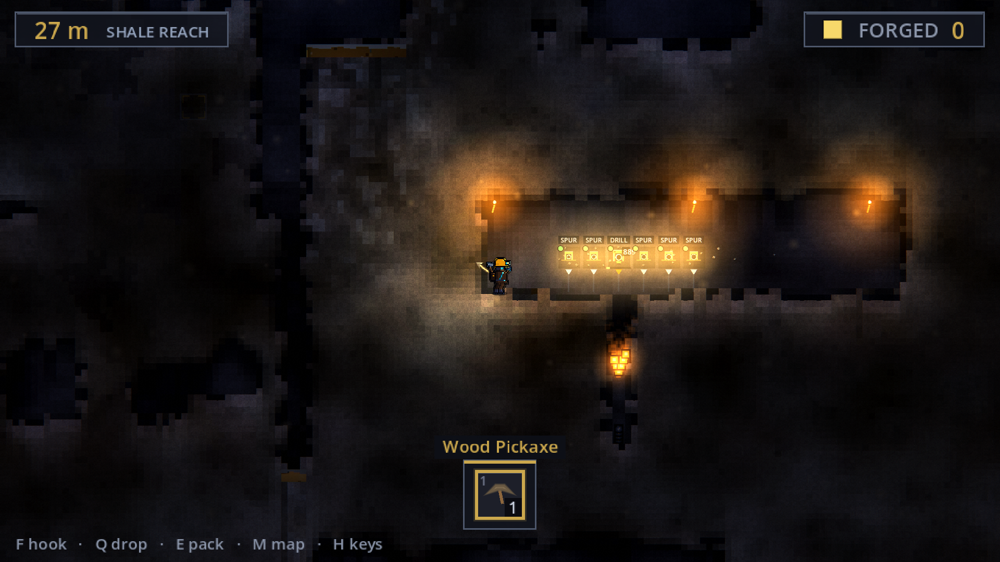
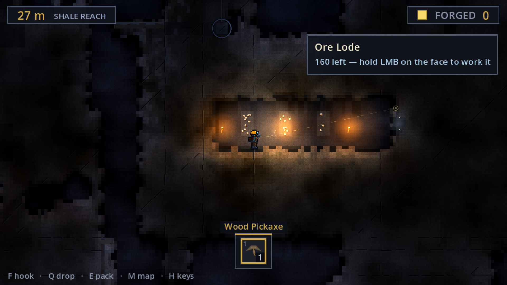

# Sinkforge

A 2D side-view game about digging a factory down into solid earth.

[](https://godotengine.org)
[](LICENSE)

Gravity carries a machine's output downward for free. Moving anything back up, including the miner,
costs power. Production lines therefore grow vertically, while the tunnels around them sprawl in any
direction.



## What it is

The world is a 128 by 128 grid at 32 pixels to a cell, and a metre is one cell. The surface datum
sits at row 20: above it is open sky, and from there down to row 127 the ground is solid and minable,
so the deepest rock reads 107 metres down. A new game starts at the surface with a wood pickaxe and
nothing else.

Mining is done by hand at first. Ore goes into a pack, the pack goes to a forge, the forge turns it
into ingots. Automation then takes that work over. A drill bores the vein on its own, its output
falls down the column into the forge below, a hopper or a splitter routes what comes out, and a
power conduit feeds whatever needs feeding. Once a column runs unattended the miner climbs back out
and digs further down.

Moving material back up costs power. A Lift carries 2 items per tick hand-cranked and 6 at full
power. A Pump reaches 4 cells straight down and drains 3 units of water per tick at full power, and
none at all unpowered.

The descent is banded and named: Topsoil at the datum, then the Clayband, Shale Reach, the Long
Dark, and the Deepslate, whose rock the starter wood pickaxe cannot break. At 64 metres come two
rows of unminable sealrock. No pickaxe touches the seal. It opens when a Descent Engine standing on
it has been fed 64 ingots down its column, and the breach bores a shaft through into Stonereach,
where the iron is. Sealed water pockets are seeded through the deep rock, from two rows into the
Deepslate down to the world floor, and need a pump before they are worth entering.

There is no reset and no prestige mechanic. The world is permanent and grows downward.



### Terrain is what you carve; the lode is what you extract

Ore used to *be* the rock, which made a tunnel driven through an ore body destroy everything it did
not pocket into the pack. So ore also lives in the background wall plane now, as a **lode**: a vein
with a remaining unit count, drawn into the wall bake rather than pasted over it, that you work at
the face with the same button you dig with. A blow opens a vein instead of ending it, and what the
burst did not take stays in the cell to keep working. Three things work a lode. A Drill standing on
one drains it in place, and the code calls that a Head; a Spur chains off a Head to widen the set of
cells it reaches; a Drift Rig cuts rock and sorts pay from spoil into two drop columns. There is no
separate Head definition under `src/data/machines/`, only `spur.tres` and `drift_rig.tres`: the Head
is the Drill, standing somewhere that matters.

The migration is unfinished. The generator seeds lodes into the wall plane, and a hand-placed spawn
fixture in `scenes/world_seeder.gd` opens a starter pocket with a visible face, so the first one is
guaranteed rather than left to the seed. Ore *blocks* still exist alongside all of it in the terrain
plane, and converting them is the next phase. `docs/LODE.md` is the design and `docs/LODE_PLAN.md` is
the migration, including what breaks.



## Running from source

The project needs Godot 4.6.2. `project.godot` targets the 4.6 feature set, and CI installs
`4.6.2-stable`.

```sh
git clone https://github.com/teohondascully/sinkforge
cd sinkforge
godot --path .
```

Opening `project.godot` in the editor and pressing play does the same thing.

Two things are worth knowing before cloning. The tracked tree is about 326 MB, of which 322 MB is
screenshots, so it is a large clone. And `export_presets.cfg` is gitignored, so a fresh clone runs
the game from source but cannot yet produce a packaged build.

Development happens on macOS and CI runs the project on Linux. There is no Windows job and no
Windows testing.

`CONTRIBUTING.md` covers the working setup: the commit hooks, the machine lock every Godot
invocation takes, and how to run one test layer instead of all of them.

## Controls

| Input | Action |
| --- | --- |
| `A` `D`, or left and right arrow | walk |
| `Space` | jump |
| `W` `S`, or up and down arrow | grip and climb a placed rope |
| left mouse | mine the aimed cell, or work the lode behind it; drag to paint a dig plan the miner works through |
| right mouse | place the selected item, or pick one of the placed machines back up |
| `F` or middle mouse | fire or release the grapple |
| mouse wheel | cycle the hotbar |
| `1`-`9`, `0` | select a hotbar slot directly |
| `Q` | drop the selected stack, or feed the faced cell |
| `E` | open the counter: pack, works and bench |
| `R` | configure the machine under the cursor |
| `X` | clear the painted dig plan |
| `M` | map |
| `T` | tech tree |
| `G` | production dashboard |
| `Z` | cycle zoom |
| `.` | cycle the game clock, 1x through 8x |
| `N` | mute |
| `P` | pause |
| `F5` / `F9` | save / load |
| `H` or `/` | key help |
| `Esc` | close the open screen, or open settings |

Mining, building and feeding are gated on reach, at 3.2 cells from the body's centre, and on a clear
line of sight to the target cell.

A gamepad layout ships alongside the keyboard defaults and both are live at once. The defaults live
in one file, `scenes/controls.gd`, and the settings screen rebinds them by overriding Godot's
`InputMap`. The number row is the exception: it is a fixed convention handled at its call site.

## How it is built

### The simulation and representation seam

`src/core/factory_sim.gd` holds all production state and all production math. It extends
`RefCounted`, runs on a fixed 20 Hz tick, and does not know a scene tree exists. Every script under
`src/` extends `RefCounted`, `Resource`, or another script in that directory — none extends `Node`,
and the directory contains zero `get_tree()` calls. The suites in `tests/` build a sim, tick it, and
assert on it with no scene instantiated at all.

Everything visible lives in `scenes/`: the renderer, the HUD, the falling-item sprites, the lighting
passes, the player body. They read the sim and draw it. Player input reaches the sim's discrete verbs
through a single controller, `scenes/main.gd`, so the input boundary has one crossing point.

Determinism falls out of that. The same seed and the same call sequence produce the same state,
headless or windowed, which is what makes both the save format and the test suite workable.
`tests/test_sim.gd` asserts it directly: capture the sim, restore it, tick both copies, compare
signatures.

### Content is data

Machines, recipes and materials are Godot Resources under `src/data/`. There are currently 20 machine
definitions, 6 recipes and 16 materials, and a machine is a named recipe-runner by default. 19 of the
20 carry a `behavior` StringName, and the tag's first job is presentation: `Visuals.MACHINE_STYLE` has
an entry for each of those 19, and that entry is what gives the machine its glyph and casing colour.
Only 11 of the tags also appear in `FactorySim._BEHAVIORS`, the sim-side table naming a tag's per-tick
hooks. The other 8 fall through to the default runner, 5 of them with a recipe attached, and carry a
tag so the renderer can tell a plate press from a gear mill. Adding a machine with genuinely new
per-tick work means four things: the hook functions, a row in `_BEHAVIORS`, a row in `MACHINE_STYLE`,
and the `.tres`. A machine that only runs a recipe needs the last two.

### Worldgen and rendering meet through a contract

`WorldGen.generate(cols, rows, seed)` returns a `WorldData`, which is plain data with no engine
dependencies: two grids of material ids for foreground blocks and background walls, plus deposit
richness, a background lode plane, and water levels. `FactorySim.load_world()` ingests it. The
renderer resolves material ids against `MaterialDef` resources for colour and grain. The generators
reference nothing under `scenes/`, and `scenes/world_renderer.gd` references no generator, so a new
generator and a new palette are independent changes.

The live generator is `LayeredWorldGen`, which extends the heightmap generator and adds depth-banded
ore veins, caves, rifts and sinkholes on top of a heightmap surface. Every ore body in the game is
born through one function in it, `_grow_vein`, which is what made moving ore into the lode plane a
change to one funnel rather than to every generation site.

### Drawing

Everything is drawn from code in `_draw`. The only authored images in the project are 16 miner frames
in `assets/sprites/`, each 32 by 48; every other texture the renderer hands to `draw_texture` is one
it generated itself. Lighting is a lightmap texture at one texel per cell, stretched over the world
with linear filtering: daylight floods down open columns until it meets rock, then lamps, torches,
working machines and powered conduits cut radial holes in the darkness each frame. A
`WorldEnvironment` glow pass grades the scene, and `scenes/post_fx.gdshader` adds a vignette, film
grain and a little chromatic aberration on a full-screen rect, on its own canvas layer beneath the
HUD's, so the world gets the lens and the UI stays crisp.

### Saving

`src/core/save_game.gd` captures the authoritative sim state into one versioned envelope, written
with Godot's binary Variant serializer so `Vector2i` keys and StringNames survive the round trip.
Derived state is not saved; it rebuilds on the next tick. The write encodes to a temp file, reads it
back to prove it decodes, copies the current save to `.bak`, and only then renames over the slot, so
the slot holds a complete readable game at every point. `restore()` stages the whole envelope into a
scratch dictionary before touching the sim, so a malformed file is refused without a partial write,
and a damaged slot falls back to the backup. The envelope is at version 2 and still reads version 1.

## Tests

```sh
bash tools/run_harness.sh
```

The runner registers 103 layers, one script each, and launches each as its own Godot process, up to
the CPU count in parallel. A file lock keeps two sweeps from sharing the machine. The layers fall
into roughly six kinds:

| Kind | What runs | What it can establish |
| --- | --- | --- |
| Simulation | the four headless suites in `tests/`, 64 test functions between them | deterministic state transitions, conservation, save round-trips |
| World and content | worldgen across seeds, the material and craft registries | that generated worlds and the content graph hold their invariants |
| Runtime integration | mining, climbing, lifts, settings, save and load through the real scene | that the real code path works under a controlled fixture |
| Pixels | frames captured from a real window and measured | what a frame actually renders |
| Timing | frame budget and dig-hitch probes | measured cost on one machine, with nothing else running on it |
| Play | `tools/play_tests.gd` | that a scripted pilot can reach a goal through the same reach-gated verbs a player uses |

`tools/play_tests.gd` is the closest thing here to an end-to-end test. It boots the real scene with
an empty pack and walks the real body with real physics through 16 goals, from finding and digging
the first ore, through the first self-feeding drill and forge line, breaching the seal into
Stonereach, the iron chain below it, and pumping out a generated aquifer. Four of the goals measure
friction on journeys a player has to make anyway, including the climb back out of a deep pit. Each
goal gets up to three tries, because real-time physics and heuristic navigation can miss once. Some
goals inject resources to arrange the situation; the verb under test is always the real one.

A layer reports pass, fail or skip, and skip has its own exit code rather than a quiet zero. 17 layers
are registered as needing a real window, three of which also need the machine to themselves, and the
layers that judge pixels detect the absence of a display and skip themselves. The runner prints the
three counts separately and will not print the word "ALL" over a list containing a skip. On a machine
that has a display, strict mode is on by default, so any skip fails the whole run with exit code 4.
There are six exit codes in all, and a caller that reads "not zero" as "a test failed" will misdiagnose
four of them.

103 is a count of registered layers, not a coverage figure. And the suite does not measure whether the
game is enjoyable: a play goal establishes that a scripted pilot reached it, which is a much narrower
claim.

The suite protects the real save while it runs. Every layer executes against an isolated `HOME`, and
a sentinel hashes the production save slot before and after the sweep, so a layer that writes to it
fails the run loudly with its own exit code instead of quietly eating a game.

`docs/HARNESS_LAYERS.md` covers the shape of a layer, the three-state exit protocol, and the failure
modes that have actually bitten this suite. `CONTRIBUTING.md` covers running a subset safely.

### CI

`.github/workflows/harness.yml` runs three jobs on every push to `main` and every pull request: an
authorship and capture-manifest check, the whole registration headless, and the window-dependent layers
under xvfb with a software Vulkan driver. No single job runs every layer. `check_frametime` is
deliberately excluded from CI, because a software rasterizer draws at 6 to 9 fps and its hitch ratios
then describe the rasterizer.

CI is currently red. The most recent completed run against `main`, on 2026-08-20, failed. The headless
job came back 77 pass, 0 fail and 15 skipped of the 92 layers declared at that commit; the display job
selected the 16 layers that need a surface and came back 13 pass, 3 fail, the three being
`check_grapple_reads`, `check_hud_layout` and `check_snap_frame`. One pass in each job stood assertions
down rather than making them, which the runner says out loud. This README carries no build badge while
that is the case.

## Repository map

| Path | What lives there |
| --- | --- |
| `src/core/` | the simulation: `FactorySim`, the world generators, water and power flow, save and load. No engine dependencies beyond `RefCounted`. |
| `src/data/` | content as Godot Resources — 20 machines, 6 recipes, 16 materials — plus the static rule tables for mining tiers, research, seams and bits. |
| `scenes/` | everything visible: the controller `main.gd`, the renderer, the HUD, the player body, and five shaders. |
| `assets/sprites/` | the only authored art in the project: 16 miner frames and their Aseprite source. |
| `tests/` | four headless suites sharing `test_base.gd`, 64 test functions, run with no scene tree. |
| `tools/` | the harness runner and its 103 layers, the play-tests, the capture and profiling tools, the machine lock. |
| `docs/` | architecture, decisions, design documents, the harness-layer guide, and the generated capture manifest. |
| `history/` | a dated screenshot archive, 165 frames. A record of builds that no longer exist, not an asset the game loads. |
| `_moment_*.png` | 52 canonical captures of named moments at the repository root, indexed by `docs/CAPTURE_MANIFEST.md`. Several tools address them by `res://` path. |
| `.githooks/` | the tracked `commit-msg` and `pre-commit` hooks. Activate them once per clone; `CONTRIBUTING.md` says how. |

## Documents

| File | What it is for |
| --- | --- |
| [`CONTRIBUTING.md`](CONTRIBUTING.md) | how to run the game and the tests, the house conventions, how to add a harness layer |
| [`docs/ARCHITECTURE.md`](docs/ARCHITECTURE.md) | every system, its responsibility, its public API, and what depends on it |
| [`docs/DECISIONS.md`](docs/DECISIONS.md) | the decision record: what was decided, why, and where in the repository to check it |
| [`docs/HARNESS_LAYERS.md`](docs/HARNESS_LAYERS.md) | the shape of a test layer and the failure modes this suite has actually hit |
| [`docs/GDD.md`](docs/GDD.md) | the design document — what the game is trying to be |
| [`docs/PROGRESSION.md`](docs/PROGRESSION.md) | the depth ladder: gates, research, and what each layer is for |
| [`docs/LODE.md`](docs/LODE.md) | ore in the wall plane: the design, and `docs/LODE_PLAN.md` for the migration |
| [`docs/MATERIAL_SPINE.md`](docs/MATERIAL_SPINE.md) | the shipped economy, read off the data files rather than off intent |
| [`docs/PRIORITY.md`](docs/PRIORITY.md) | the working roadmap: one ordered list, with the reasoning for every item that was demoted or reversed |

## Status

Early, and in active development.

Playable today: hand-mining, hauling and hand-feeding; crafting and placing machines from the pack; a
self-feeding drill and forge line; coal-fired power and conduit routing; ropes, a grapple and lifts;
research at a bazaar bench; the seal breach into Stonereach and the iron chain below it; water as an
integer-level fluid, with pumps to clear it. Save and load, a map, a tech tree, a production dashboard,
and a settings screen with remappable keys.

Not there yet. The generated world runs from Topsoil down to Stonereach, the second rung of the ladder
in `docs/PROGRESSION.md`. The third rung's fluid mechanic already exists as water and pumps and its
tooling is on the research tree, but the rung itself and everything past it are design rather than
code. The lode migration is mid-flight. There is no combat and no packaged build. Most of the art is
placeholder, and underground legibility is an open problem, since outside a lamp pool rock and empty
space are hard to tell apart.

Expect things to change.

## License

MIT. See [`LICENSE`](LICENSE).
